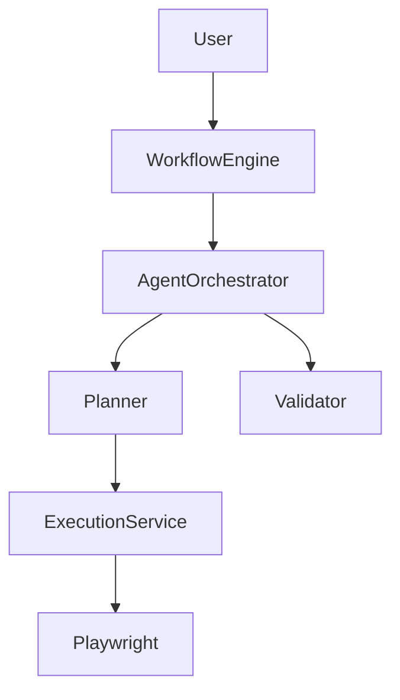

# OpenATF (Open Agent Test Framework)

> An AI-native, plugin-based, open-source software testing platform where autonomous AI agents think, plan, execute, validate, analyze, and report software quality like an experienced QA Engineer.

---

# 🚀 Vision

To build an intelligent software testing platform that transforms traditional automation into autonomous quality engineering.

OpenATF enables AI agents to understand requirements, analyze impact, plan execution, validate results, investigate failures, and generate actionable insights while remaining independent of any specific application or automation tool.

---

# ❗ Problem Statement

Current automation frameworks have several limitations:

- Script-driven instead of intelligence-driven
- Frameworks are tightly coupled to specific applications
- Test execution requires significant manual planning
- Failures require manual root cause analysis
- Release impact analysis is manual
- Reporting is static and lacks actionable insights
- AI tools generate generic responses instead of reasoning like experienced QA engineers

OpenATF aims to solve these challenges by introducing an AI-first testing platform.

---

# 🎯 Product Goals

- Build an AI-first software testing platform
- Support any web or mobile application through plugins
- Allow AI agents to reason before execution
- Reduce manual QA effort
- Improve automation maintainability
- Generate meaningful reports instead of raw execution data
- Provide explainable AI decisions
- Keep the framework completely open source and extensible

---

# ⭐ Key Features (Planned)

- AI Requirement Analysis
- Impact Analysis
- Intelligent Test Planning
- Autonomous Test Execution
- AI Validation Engine
- Root Cause Analysis (RCA)
- AI Reporting
- Plugin Architecture
- Jira Integration
- Confluence Integration
- Release Note Analysis
- AI Code Review
- Self-Healing Recommendations
- Knowledge Base (RAG)
- Multi-Agent Collaboration
- Dashboard & Analytics

---

# 🏗 High-Level Architecture

> Coming Soon

---

# 🧩 Plugin Architecture

> Coming Soon

---

# 🤖 AI Agent Architecture

> Coming Soon

---

# 📂 Project Structure

> Coming Soon

---

# 🛣 Roadmap

## Version 0.1 (MVP)

- Project Foundation
- Plugin Architecture
- Playwright Execution Engine
- Ollama Integration
- Planner Agent
- Validation Agent
- AI Execution Summary

---

## Version 0.5

- Requirement Intelligence
- Release Note Analysis
- Jira Integration
- AI Test Selection
- Root Cause Analysis

---

## Version 1.0

- Multi-Agent System
- Knowledge Base (RAG)
- Dashboard
- Self-Healing Recommendations
- AI Test Review
- Mobile Automation Support

---

# 🤝 Contributing

Documentation coming soon.

---

# 📄 License

MIT License (Planned)

---

**OpenATF** is being designed as an enterprise-grade, AI-native testing platform for the software quality engineering community.
           Standard 1: ASCII Architecture Diagrams (Primary)                 		
 Standard 2: Mermaid Diagrams (Professional)

Standard 3: C4 Architecture
System
   |
   +-- OpenATF
         |
         +-- Agent Orchestrator
         +-- Plugin Manager
         +-- Execution Engine
         +-- Reporting Engine

 Standard 4: Sequence Diagrams
User
 |
 | Run Germany Smoke
 |
 v
Workflow Engine
 |
 | Create Plan
 |
 v
Planner Agent
 |
 | Execute Smoke Suite
 |
 v
Execution Service
 |
 | Launch Browser
 |
 v
Playwright
 |
 | Result
 |
 v
Validation Agent
 |
 | Validate
 |
 v
Reporting Service
 |
 | Generate Summary
 |
 v
User
 Documentation Standards
docs/

├── 01-Vision.md
├── 02-HLD.md
├── 03-LLD.md
├── 04-Agent-Architecture.md
├── 05-Plugin-Architecture.md
├── 06-Service-Architecture.md
├── 07-Sequence-Diagrams.md
├── 08-API-Design.md
├── 09-Coding-Standards.md
├── 10-Roadmap.md

 One More Standard (Very Important)
Every diagram will have:
•	Title 
•	Purpose 
•	Description 
•	Diagram 
•	Key Points 
For example:
## Figure 1 - High Level Architecture

### Purpose
Shows how requests flow through OpenATF.

### Description
A user request enters the Workflow Engine, which coordinates AI agents. Agents make decisions and delegate execution to services. Services interact with infrastructure components like Playwright and Ollama.

### Diagram

<ASCII Diagram>

### Key Points
- Agents make decisions.
- Services perform work.
- Infrastructure remains replaceable.
